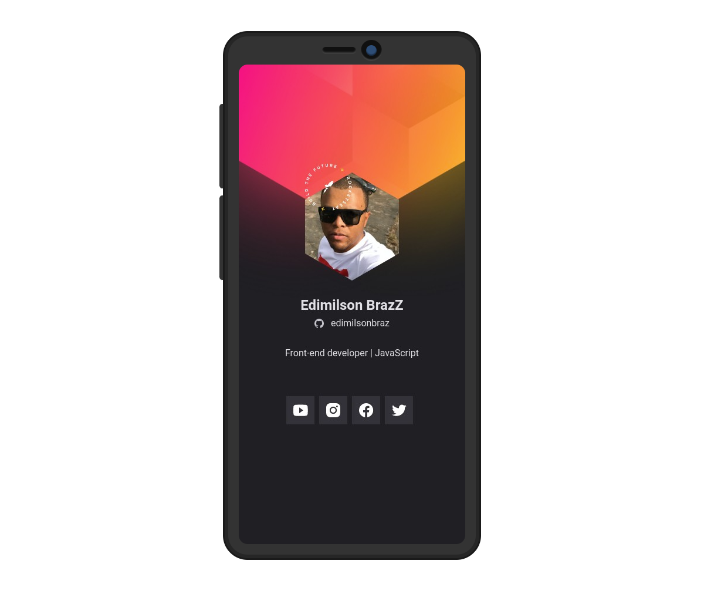

# Cracha-nwl-Heat
Este projeto foi desenvolvimento durante a NLW-Heat(Next Level Week) da Rocketseat.

---
<h1 align="center">
  
</h1>

## :computer: Projeto
Cracha virtual responsivo, onde aplicamos conceitos de "Como consumir uma API"(API do Github),  tratar os dados em json e manipular estes dados no front e várias dicas de css pra deixar este projeto com uma cara profissional.

Dê uma conferida [aqui](https://edimilsonbraz.github.io/nlw-heat/) 

 *Tem que adaptar sua tela para mobile 

---
 

## :point_right: Tecnologias

Toda a base dessa aplicação foi desenvolvida durante a semana NLW Heat da [Rocketseat](https://rocketseat.com.br) com a instrutor(a) Mayk & Jakeline. 

-  ⚛️ CSS
-  ⚛️ HTML
-  ⚛️ JAVASCRIPT

---
 

## :computer: Licença

  

---
 

## :computer: Autor

<a href="#">
 
  <b>Edimilson Braz</b></a>🚀

Feito com ❤️ por Edimilson Braz 👋🏽 Entre em contato!

 
